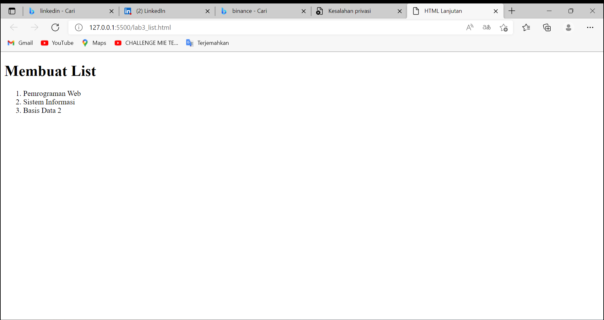
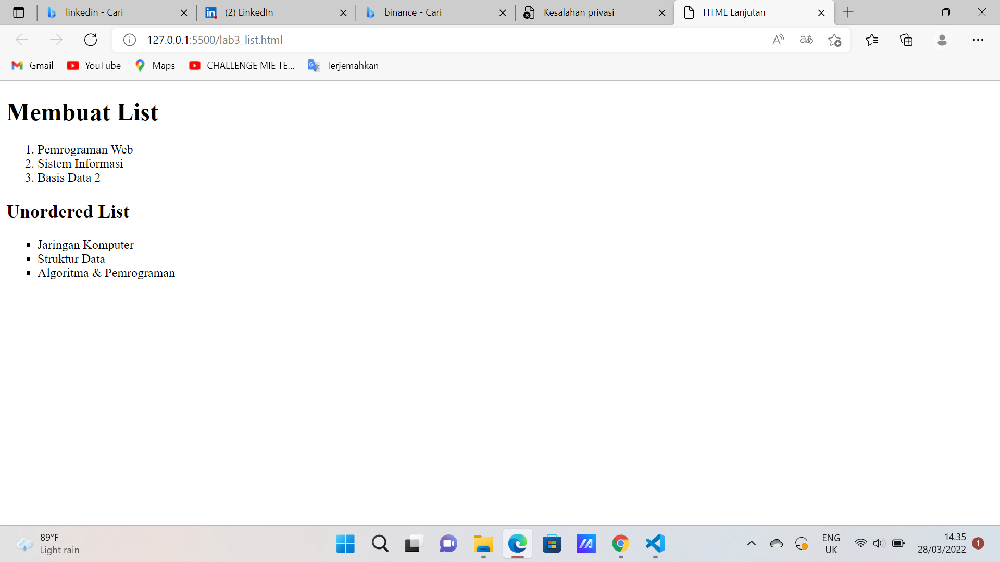
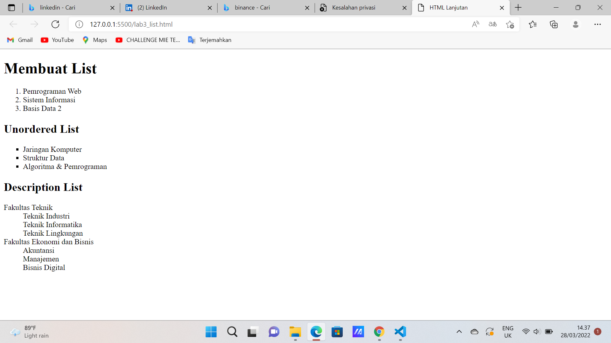

| Ahmad Alfian Chandra      | 312010336     |
| ---------------------     | ------------  |
| praktikum                 | pertemuan 5   |

## 1 Membuat orderet list
### CODE DAN TAMPILAN 



order list adalah list yang tersusun secara urut dalam tag nya terdapat tag OL dan LI 

```html
<!DOCTYPE html>
<html lang="en">
<head>
    <meta charset="UTF-8">
    <meta http-equiv="X-UA-Compatible" content="IE=edge">
    <meta name="viewport" content="width=device-width, initial-scale=1.0">
    <title>HTML Lanjutan</title>
</head>
<body>
    <header>
        <h1>Membuat List</h1>
    </header>
    <ol id="order-list">
        <li>Pemrograman Web</li>
        <li>Sistem Informasi</li>
        <li>Basis Data 2</li>
    </ol>
</body>
</html>
```

## 2 Membuat Unordered list
### CODE DAN TAMPILAN



Unordered list adalah list yang tidak terurut atau acak dengan awalan tag UL dan LI 

```html
<section id="unorder-list">
        <h2>Unordered List</h2>
        <ul type="square">
            <li>Jaringan Komputer</li>
            <li>Struktur Data</li>
            <li>Algoritma &amp; Pemrograman</li>
        </ul>
    </section>
```
## 3 Membuat Description List
### CODE DAN TAMPILAN



Description list yaitu dengan di awali tag DL sebagai pemuat konten kemudian DT sebagai konten istilah dan DD sebagai penjelas konten istilah tersebut

```html
<section id="unorder-list">
        <h2>Description List</h2>
        <dl>
            <dt>Fakultas Teknik</dt>
            <dd>Teknik Industri</dd>
            <dd>Teknik Informatika</dd>
            <dd>Teknik Lingkungan</dd>
            <dt>Fakultas Ekonomi dan Bisnis</dt>
            <dd>Akuntansi</dd>
            <dd>Manajemen</dd>
            <dd>Bisnis Digital</dd>
        </dl>
    </section>
```

