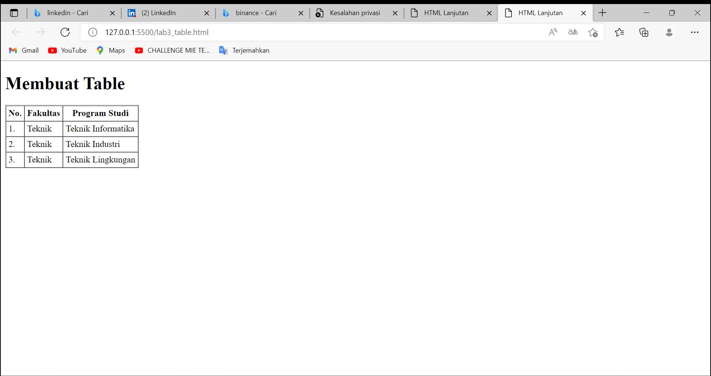
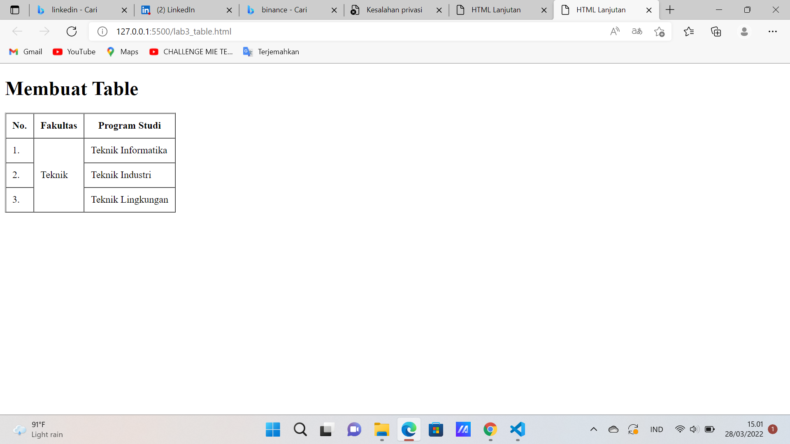
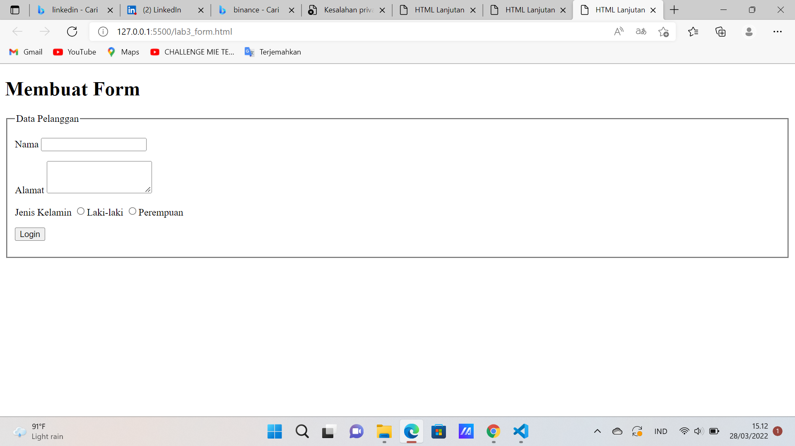

| Ahmad Alfian Chandra      | 312010336     |
| ---------------------     | ------------  |
| praktikum                 | pertemuan 5   |

## 1 Membuat orderet list
### CODE DAN TAMPILAN 


order list adalah list yang tersusun secara urut dalam tag nya terdapat tag OL dan LI 

```html
<!DOCTYPE html>
<html lang="en">
<head>
    <meta charset="UTF-8">
    <meta http-equiv="X-UA-Compatible" content="IE=edge">
    <meta name="viewport" content="width=device-width, initial-scale=1.0">
    <title>HTML Lanjutan</title>
</head>
<body>
    <header>
        <h1>Membuat List</h1>
    </header>
    <ol id="order-list">
        <li>Pemrograman Web</li>
        <li>Sistem Informasi</li>
        <li>Basis Data 2</li>
    </ol>
</body>
</html>
```

## 2 Membuat Unordered list
### CODE DAN TAMPILAN


Unordered list adalah list yang tidak terurut atau acak dengan awalan tag UL dan LI 

```html
<section id="unorder-list">
        <h2>Unordered List</h2>
        <ul type="square">
            <li>Jaringan Komputer</li>
            <li>Struktur Data</li>
            <li>Algoritma &amp; Pemrograman</li>
        </ul>
    </section>
```
## 3 Membuat Description List
### CODE DAN TAMPILAN


Description list yaitu dengan di awali tag DL sebagai pemuat konten kemudian DT sebagai konten istilah dan DD sebagai penjelas konten istilah tersebut

```html
<section id="unorder-list">
        <h2>Description List</h2>
        <dl>
            <dt>Fakultas Teknik</dt>
            <dd>Teknik Industri</dd>
            <dd>Teknik Informatika</dd>
            <dd>Teknik Lingkungan</dd>
            <dt>Fakultas Ekonomi dan Bisnis</dt>
            <dd>Akuntansi</dd>
            <dd>Manajemen</dd>
            <dd>Bisnis Digital</dd>
        </dl>
    </section>
```

## 4 Membuat table
### CODE DAN TAMPILAN



dalam membuat table di perlukan tag table dan kemudian thead yang di dalamnya ada TR dan TH untuk table head dan kemudian tbody yang di dalamnya ada TR dan TD

```html
<!DOCTYPE html>
<html lang="en">

<head>
    <meta charset="UTF-8">
    <meta name="viewport" content="width=device-width, initial-scale=1.0">
    <title>HTML Lanjutan</title>
</head>

<body>
    <header>
        <h1>Membuat Table</h1>
    </header>
    <table border="1" cellpadding="4" cellspacing="0">
        <thead>
            <tr>
                <th>No.</th>
                <th>Fakultas</th>
                <th>Program Studi</th>
            </tr>
        </thead>
        <tbody>
            <tr>
                <td>1.</td>
                <td>Teknik</td>
                <td>Teknik Informatika</td>
            </tr>
            <tr>
                <td>2.</td>
                <td>Teknik</td>
                <td>Teknik Industri</td>
            </tr>
            <tr>
                <td>3.</td>
                <td>Teknik</td>
                <td>Teknik Lingkungan</td>
            </tr>
        </tbody>
    </table>
</body>

</html>
```
## 5 menambahkan Margin dan Padding
### CODE DAN TAMPILAN


sebelumnya Cellpadding 4 Cellspadding 0 yang saya ubah menjadi Cellpadding 10 dan Cellspadding 0 contoh gambar di atas adalah hasilnya

```html
<table border="1" cellpadding="10" cellspacing="0">
```
## 6 Menggambungkan Celldata
### CODE DAN TAMPILAN



Dalam menggambungkan cell data secara vertikal menggunakan atribut rowspan secara horizontal menggunakan atribut colspan 

```html
<table border="1" cellpadding="10" cellspacing="0">
        <thead>
            <tr>
                <th>No.</th>
                <th>Fakultas</th>
                <th>Program Studi</th>
            </tr>
        </thead>
        <tbody>
            <tr>
                <td>1.</td>
                <td rowspan="3">Teknik</td>
                <td>Teknik Informatika</td>
            </tr>
            <tr>
                <td>2.</td>
                <td>Teknik Industri</td>
            </tr>
            <tr>
                <td>3.</td>
                <td>Teknik Lingkungan</td>
            </tr>
        </tbody>
    </table>
```
## 7 Membuat Form
### CODE DAN TAMPILAN



dalam membuat form di perlukan tag form yang kemudian yang di tambahkan fieldset yang kemudian di tambahkan tag input sesuai kebutuhan codingan 

```html
<!DOCTYPE html>
<html lang="en">

<head>
    <meta charset="UTF-8">
    <meta name="viewport" content="width=device-width, initial-scale=1.0">
    <title>HTML Lanjutan</title>
</head>

<body>
    <header>
        <h1>Membuat Form</h1>
    </header>
    <form action="proses.php" method="post">
        <fieldset>
            <legend>Data Pelanggan</legend>
            <p>
                <label for="nama">Nama</label>
                <input type="text" id="nama" name="nama">
            </p>
            <p>
                <label for="alamat">Alamat</label>
                <textarea id="alamat" name="alamat" cols="20" rows="3"></textarea>
            </p>
            <p>
                <label>Jenis Kelamin</label>
                <input id="jk_l" type="radio" name="kelamin" value="L" /><label for="jk_l">Laki-laki</label>
                <input id="jk_p" type="radio" name="kelamin" value="P" /><label for="jk_p">Perempuan</label>
            </p>
            <p><input type="submit" value="Login"></p>
        </fieldset>
    </form>
</body>

</html>
```

## 8 menambahkan css internal
### CODE DAN TAMPILAN


menambahkan css internal pada form html 

```css
<style>
        form p > label {
        display: inline-block;
        width: 100px;
        }
        form input[type="text"], form textarea {
        border: 1px solid #197a43;
        }
        form input[type="submit"] {
        border: 1px solid #197a43;
        background-color: #197a43;
        color: #ffffff;
        font-weight: bold;
        padding: 5px 15px;
        }
        </style>
```